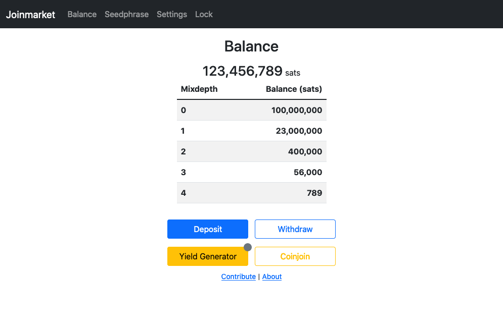

# Frontend for Joinmarket

This is an alpha version of a Frontend for Joinmarket as an extension as Specter Desktop.
## Screenshots



## How to install

### Install Bitcoin core
- Install and run a Bitcoin core node ([bitcoincore.org](https://bitcoincore.org/en/download/))
- Configure Bitcoin RPC server

### Install JoinMarket or Joininbox
- [Joinmarket](https://github.com/JoinMarket-Org/joinmarket-clientserver)
- [JoininBox](https://github.com/openoms/joininbox)
- Configure SSL certificate
	- `mkdir ~/.joinmarket/ssl`
	- `openssl req -newkey rsa:4096 -x509 -sha256 -days 3650 -nodes -out ~/.joinmarket/ssl/cert.pem -keyout ~/.joinmarket/ssl/key.pem`
- Run wallet daemon: `python scripts/jmwalletd.py`

## Installation as Specter-Extension
```
virtualenv --python=python3 .env
. ./.env/bin/activate
pip3 install -r requirements.txt
python3 -m cryptoadvance.specter server --config DevelopmentConfig --debug
# http://localhost:25441
# choose the joinmarket service (you might need to activate )
```